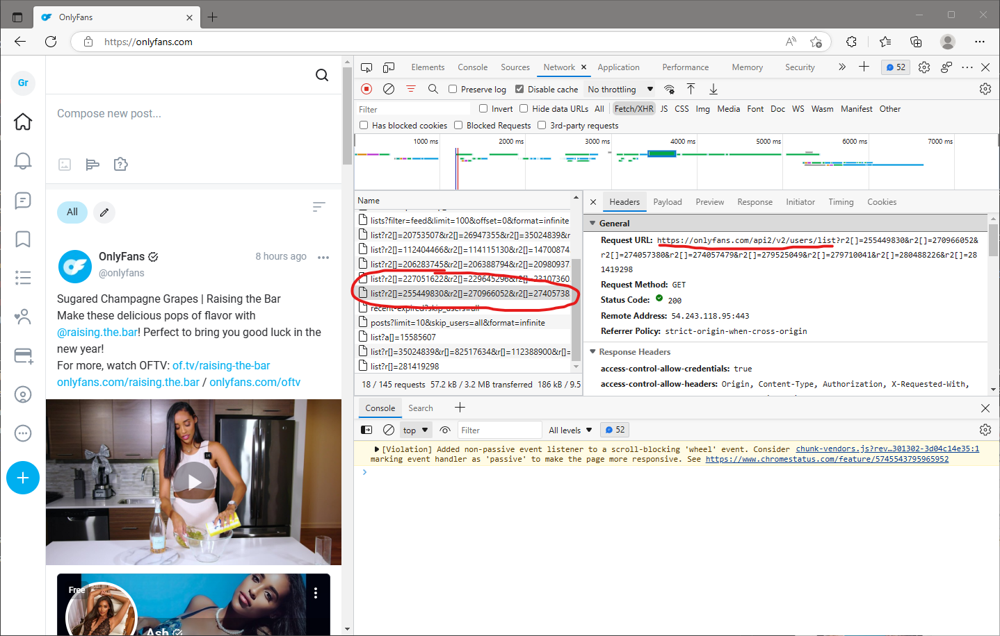
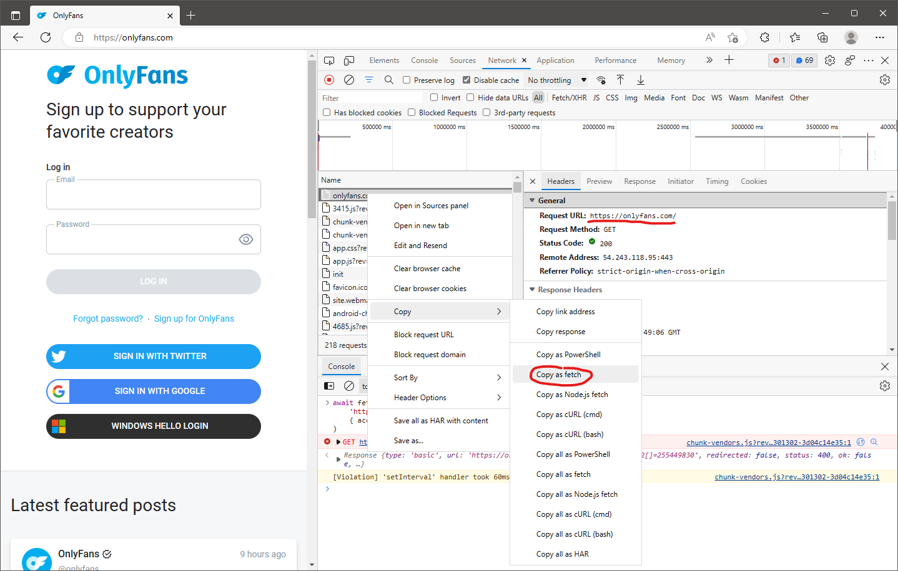
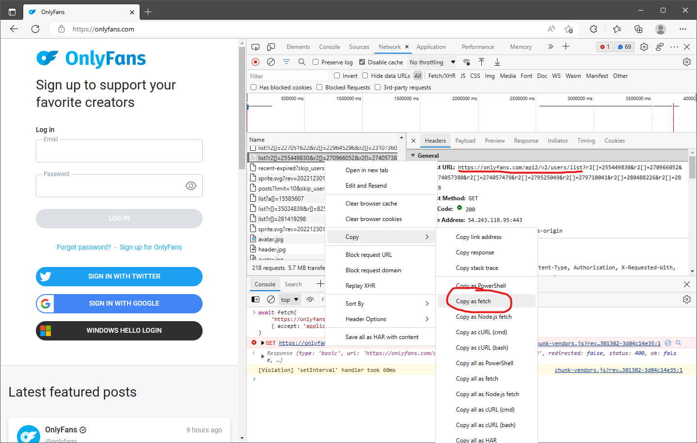
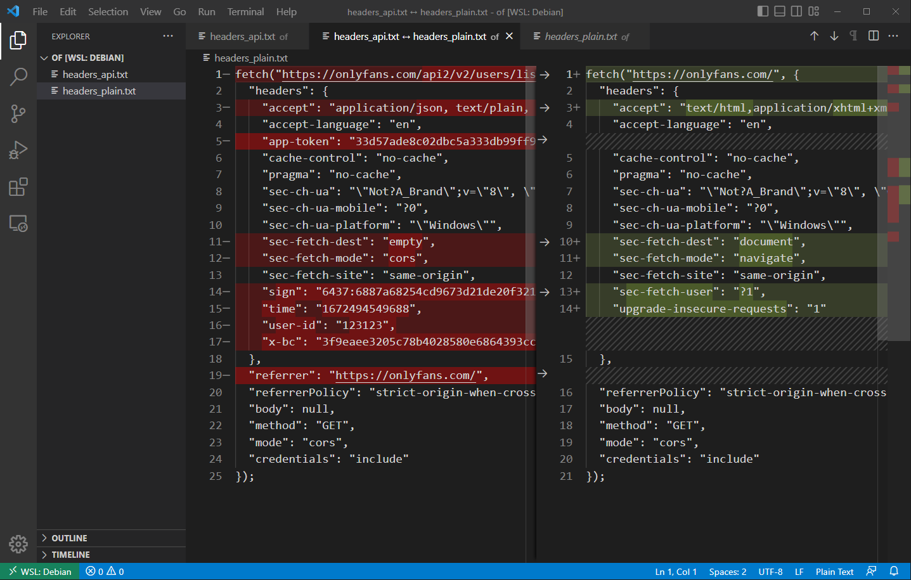
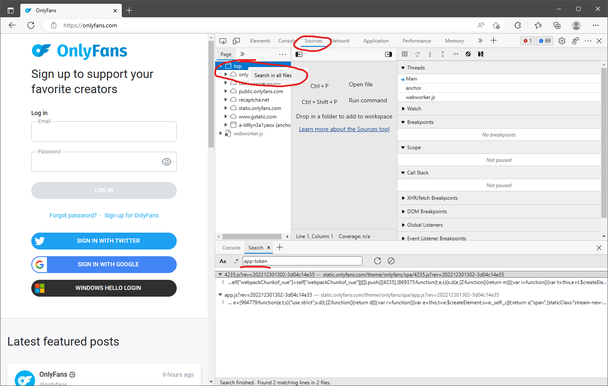
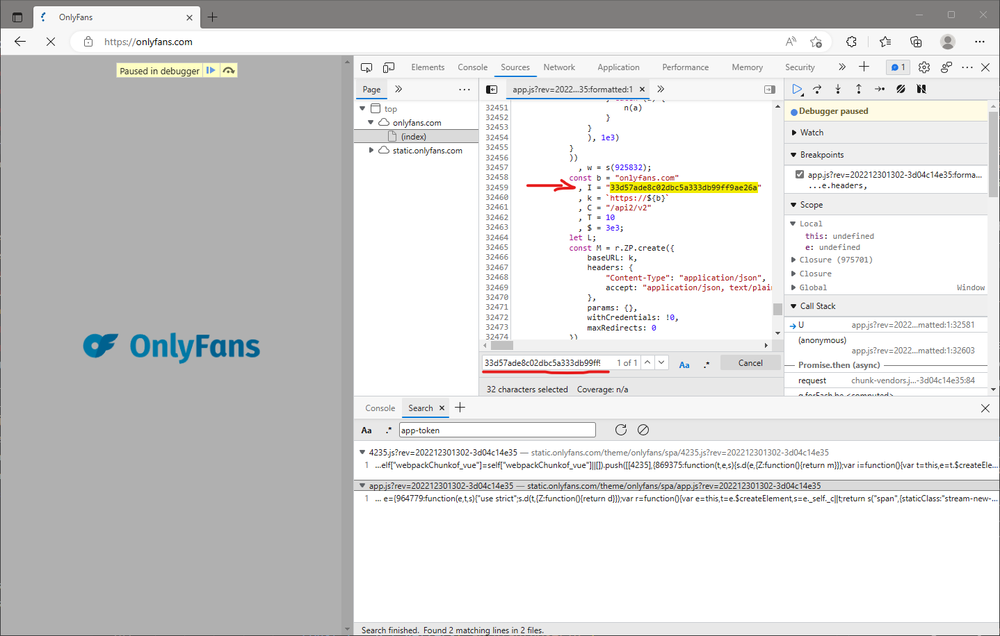
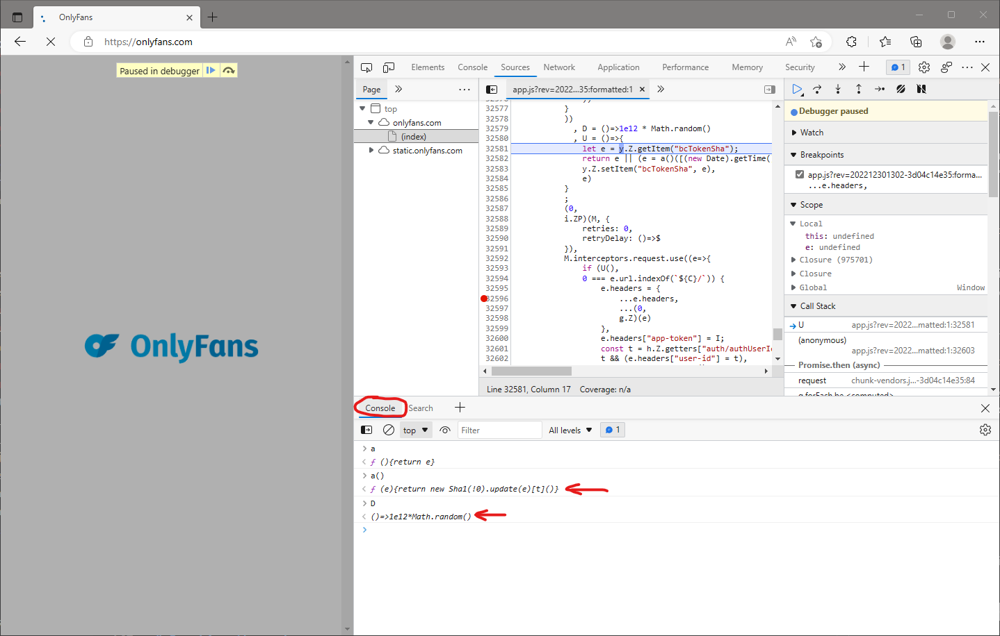
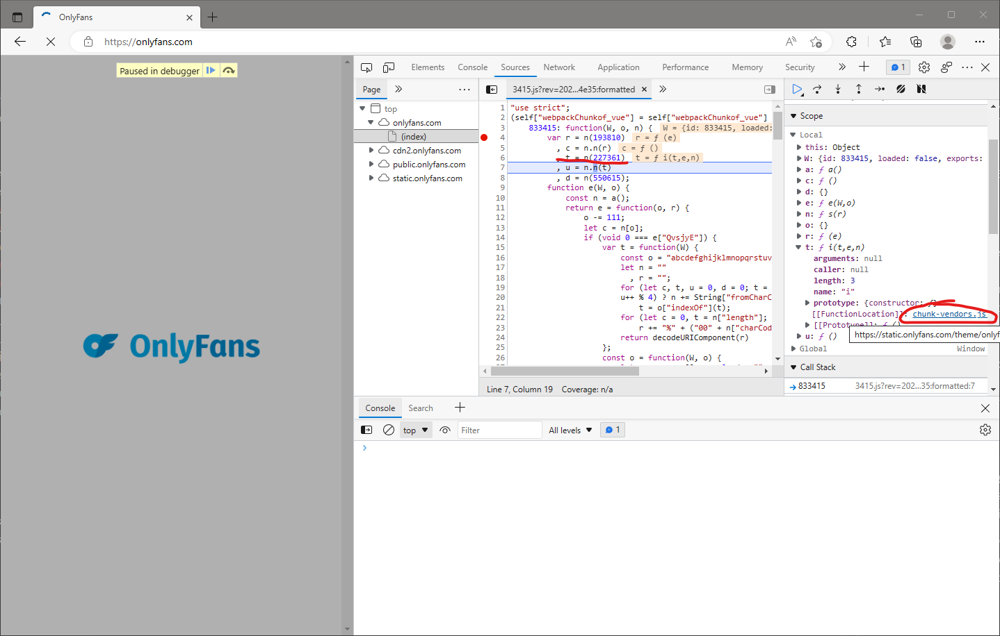
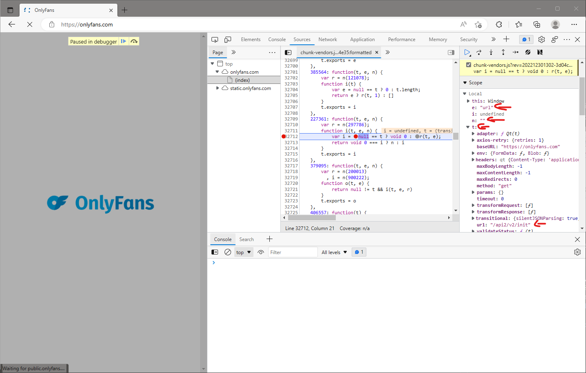
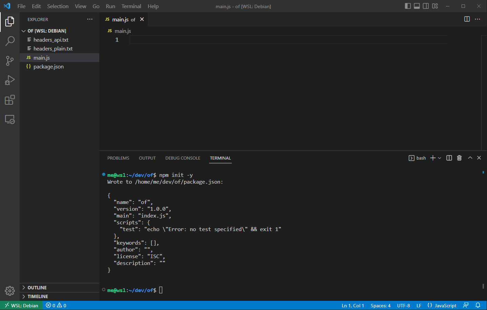

The full, slightly modified source code accompanying this article can be found on the [GitHub](https://github.com/SneakyOvis/onlyfans-dynamic-rules).

Warning: this is begginer-level material; if you know anything about JS reverse engineering, you will probably bore yourself to death.

Warning2: code minimization/obfuscation will change the names and flow of the program, so you won't get exactly the same code as when I created this document.

# Introduction

Let me show you how easy and fun it is to reverse engineer web apis. Our target is OnlyFans, we would like to know how to properly create requests to their api. There are a few things needed to get started:

- [OnlyFans](https://onlyfans.com/) account, of course
- knowledge of basic [Web](https://developer.mozilla.org/docs/Web) technologies (HTTP, HTML, JavaScript)
- JavaScript runtime: [Node.js](https://nodejs.org/) 
- code editor, I personally like [VSC](https://code.visualstudio.com/)
- with VSC I use Debian on WSL2, but it is not necessary
- a brain (yeah, I know, but you can't do without it)

# Reconnaissance

Let's log on to OnlyFans and open the browser's DevTools by pressing **F12**. Next, go to the **Network** tab, then select the **Fetch/XHR** filter.


We see a list of requests. Now, looking at the **URL** in the headers of one of them, we can assume that this is a typical **REST** api.



I wonder if we can just make the request knowing the url. Using fetch it will be:

```javascript
await fetch(
    'https://onlyfans.com/api2/v2/users/list?r2[]=255449830',
    { accept: 'application/json, text/plain, */*' }
)
```


Oops, error code 400 and forced logout. Of course, for this to work, we need the right headers. We can easily examine the difference between **plain** and **api** request headers using VSC. Just create two files, copy the request headers from the browser for plain and api requests respectively, then select both files and choose **Compare Selected** from the pop-up menu.





So, what do we get? The **referer** header is appended by the browser to subsequent requests. Then, the **accept** header is needed when we expect a json response. The **sec-** headers i won't cover here. That leaves us with:

```
"app-token": "33d57ade8c02dbc5a333db99ff9ae26a"
"sign": "6437:6887a68254cd9673d21de20f3217824fed072b5d:6bd:63aee19d"
"time": "1672494549688"
"user-id": "123123"
"x-bc": "3f9eaee3205c78b4028580e6864393cc79d5c33c"
```

# Digging into the sources

Ok, now we need to go to the **Sources** tab in DevTools to work with the application source code. Let's start with **app-token** string, find out if it appears in the code.



Two hits: **4235.js** and **app.js**. The **app.js** file appears to contain the main code for the application, so let's start there. Click the code snippet to open the source file, then make sure to click **{}** to nicely format the code, which is unreadable due to minimization.


You should see something similar to this:

```javascript
M.interceptors.request.use((e=>{
    if (U(),
    0 === e.url.indexOf(`${C}/`)) {
        e.headers = {
            ...e.headers,
            ...(0,
            g.Z)(e)
        },
        e.headers["app-token"] = I;
        const t = h.Z.getters["auth/authUserId"];
        t && (e.headers["user-id"] = t),
        e.headers["x-bc"] = U()
    }
    return e
}
)),
```

Now log back into OnlyFans, and then set a breakpoint somewhere. Where exactly? It looks like **e.headers** is getting a value from both itself and a result of some function. I mean, this part:

```javascript
e.headers = {
    ...e.headers,
    ...(0,
    g.Z)(e)
},
```

Let's try to stop there and see what **e** and **g.Z** variables are. Click on the line number to set a breakpoint, and then reload the web page. When the application stops, we can examine the variables in the right pane, whether they are local, closure or global.


So what do we see there?

```javascript
e:
    headers: qt
        Content-Type: "application/json"
        accept: "application/json, text/plain, */*"
    url: "/api2/v2/init"

g:
    Z: 
        W=> {…}
        length: 1
        name: ""
        arguments: (...)
        caller: (...)
        [[FunctionLocation]]: 3415.js?rev=202212301302-3d04c14e35:1
        [[Prototype]]: ƒ ()

```

I've copied only the most interesting parts of the **e** object: an **url** and **headers**. The **g.Z**, on the other hand, is a function from **3415.js** file. We'll get there in a moment, but now just step over the next function call by pressing **F10**. Do it second time to see that there's something new in the **e.headers** object.

```javascript
e:
    headers:
        Content-Type: "application/json"
        accept: "application/json, text/plain, */*"
        sign: "6437:d685ce0063c19ce301ff42c544eae570388b0697:77e:63aee19d"
        time: 1672505467206
```

Now we know that in the **3415.js** file there is a function that generates a **sign** header along with a **time** timestamp. Another interesting part is this:

```javascript
e.headers["app-token"] = I;
```

So the **app-token** header is a value stored in a variable named **I**. We know what the value is from earlier, so let's perform a search for the string **33d57ade8c02dbc5a333db99ff9ae26a** in the current file (**Ctrl-F**).



Note that The **app-token** header is just a plain string in the **app.js** file. Step over the next function call (**F10**):

```javascript
                    const t = h.Z.getters["auth/authUserId"];
                    t && (e.headers["user-id"] = t),
```

I wouldn't worry about **user-id**, it's just a single numeric value, as we discovered earlier. And the last thing is **x-bc**, which is the value returned by the function named **U**.

```javascript
e.headers["x-bc"] = U()
```

Step over function calls till this line using **F10**, then step into the function call by pressing **F11**. We are here:

```javascript
, U = ()=>{
let e = y.Z.getItem("bcTokenSha");
return e || (e = a()([(new Date).getTime(), D(), D(), window.navigator.userAgent].map(btoa).join(".")),
y.Z.setItem("bcTokenSha", e),
e)
```

By using console, we can quickly discover what is happening here:



So **x-bc** is generated this way:

```javascript
parts = [
    (new Date).getTime(),
    1e12*Math.random(),
    1e12*Math.random(),
    window.navigator.userAgent,
];
msg = parts.map(btoa).join('.');
token = sha1(msg);
```

So far, we have collected the following information:

```
'app-token' is just a plain variable in the 'app.js' file
'sign' is generated in the '3415.js' file
'time' is, well, probably the value of js time (number of milliseconds since 1970)
'user-id' is your user id
'x-bc' is generated by using mixture of time, random values and user agent string
```

Let's remove the breakpoint and resume the execution of the script (**F8**). We are heading to the **3415.js** file.

# Breaking the code

Search all files for the string **3415**, click the corresponding code snippet, don't forget to format the code by clicking **{}**.

```javascript
"use strict";
(self["webpackChunkof_vue"] = self["webpackChunkof_vue"] || []).push([[3415], {
    833415: function(W, o, n) {
        var r = n(193810)
          , c = n.n(r)
          , t = n(227361)
          , u = n.n(t)
          , d = n(550615);
        function e(W, o) {
            const n = a();
            return e = function(o, r) {
                o -= 111;
                let c = n[o];
                if (void 0 === e["QvsjyE"]) {
                    var t = function(W) {
                        const o = "abcdefghijklmnopqrstuvwxyzABCDEFGHIJKLMNOPQRSTUVWXYZ0123456789+/=";
                        let n = ""
                          , r = "";
                        for (let c, t, u = 0, d = 0; t = W["charAt"](d++); ~t && (c = u % 4 ? 64 * c + t : t,
                        u++ % 4) ? n += String["fromCharCode"](255 & c >> (-2 * u & 6)) : 0)
                            t = o["indexOf"](t);
                        for (let c = 0, t = n["length"]; c < t; c++)
                            r += "%" + ("00" + n["charCodeAt"](c)["toString"](16))["slice"](-2);
                        return decodeURIComponent(r)
                    };
                    const o = function(W, o) {
                        let n, r, c = [], u = 0, d = "";
                        for (W = t(W),
                        r = 0; r < 256; r++)
                            c[r] = r;
                        for (r = 0; r < 256; r++)
                            u = (u + c[r] + o["charCodeAt"](r % o["length"])) % 256,
                            n = c[r],
                            c[r] = c[u],
                            c[u] = n;
                        r = 0,
                        u = 0;
                        for (let t = 0; t < W["length"]; t++)
                            r = (r + 1) % 256,
                            u = (u + c[r]) % 256,
                            n = c[r],
                            c[r] = c[u],
                            c[u] = n,
                            d += String["fromCharCode"](W["charCodeAt"](t) ^ c[(c[r] + c[u]) % 256]);
                        return d
                    };
                    e["AnoYAt"] = o,
                    W = arguments,
                    e["QvsjyE"] = !0
                }
```

Yes, it's just the first few lines. To me it looks like a horror movie, I wouldn't even try to read it. Instead, we will try to find out what this code does by using it. Let me illustrate the situation:


Do they really expect me to try to force the secured door when there is an open window right next to it?

Let's set a breakpoint at the beginning of the function, reload the page and analyze the parameters. There are three: **W**, **o**, **n**. Using the console, find out what they are:

```
> W
< {id: 833415, loaded: false, exports: {…}}
> o
< {}
> n
< ƒ s(r){var n=t[r];if(void 0!==n)return n.exports;var a=t[r]={id:r,loaded:!1,exports:{}};return e[r].call(a.exports,a,a.exports,s),a.loaded=!0,a.exports}
```

Well, **n** seems to be the only important one here. Try using it in the same way the function does:

```
> r = n(193810)
< ƒ (e){return new Sha1(!0).update(e)[t]()}
> c = n.n(r)
< ƒ (){return e}
> c()
< ƒ (e){return new Sha1(!0).update(e)[t]()}
```

```
> t = n(227361)
< ƒ i(t,e,n){var i=null==t?void 0:r(t,e);return void 0===i?n:i}
> u = n.n(t)
< ƒ (){return e}
> u()
< ƒ i(t,e,n){var i=null==t?void 0:r(t,e);return void 0===i?n:i}
```

```
> d = n(550615)
< {}
```

That's all. I hope it's clear to anyone with half a brain what's going on here. The **n** function is used to import objects. Calling **n(193810)** returns a function that calculates the SHA. As for **n(227361)** I don't know what the returned function does, we'll find out in a moment. And **n(550615)** simply returns an empty object. Also there is **n.n** function, which seems to be something like this:

```javascript
n.n = function(obj) {
    return () => obj;
}
```

Now the only mystery left is this function returned by the **n(227361)** call. I'm going to walk past this call and see exactly where this function is defined:



By clicking **chunk-vendors.js...** and reformatting the code, we see something like this:

```javascript
    227361: function(t, e, n) {
        var r = n(297786);
        function i(t, e, n) {
            var i = null == t ? void 0 : r(t, e);
            return void 0 === i ? n : i
        }
        t.exports = i
    },
```

Set a breakpoint on the inner function, remove the previous breakpoint and reload the page:



Function **227361** is used to retrieve properties from objects, returning a default value if not found. This can be easily seen in the parameters: **t** is the object that contains the property **url**, **e** is the **'url'** string, and the **n** is the empty string. To be precise, it seems to do a bit more, but I'll just ignore it for now. Let's assume that this is enough:

```javascript
function getProperty(obj, prop, def) {
    return obj[prop] ? obj[prop] : def;
}
```

Ok, that's it. What we learned:

```javascript
833415: function(W, o, n)
/*
W -> probably can be just empty object
o -> an empty object for sure
n -> import function
*/

n.n = function(obj) {
    return () => obj;
}

n(193810) -> sha
n(227361) -> function(obj, prop, def) {
    return obj[prop] ? obj[prop] : def;
}
n(550615) -> {}

```

# Passing through the window

We will leave the browser for now and try our luck with **NodeJS**. In the code editor, we close all files, open the terminal and initialize the node project. We insert the following into 'package.json':

```
  "type": "module",
  "scripts": {
    "dev": "@node --no-warnings main.js",
    "prod": "@node --no-warnings main.js prod"
  },
```

Create a **main.js** file and start actually writing the code.

Oh, we've done with images too, that's the last one:



So we need this **3415.js** script. Make sure to save the downloaded script so that we don't make network requests every time our code runs in development. But with the 'prod' argument, we can force a download on production.

```javascript
import { existsSync, readFileSync, writeFileSync } from 'fs';
import { parse } from 'path';

const production = process.argv[process.argv.length - 1] === 'prod' ? true : false;

async function getCode(url) {
    const name = parse(url).base
    if (!production) {
        if (existsSync(name)) {
            console.log('Fetching script from disk.');
            return readFileSync(name).toString();
        }
    }

    console.log('Fetching script from network.')
    const response = await fetch(url);
    if (!response.ok) {
        throw new Error('fetch script error');
    }

    const code = await response.text();
    writeFileSync(name, code);
    return code;
}

async function main() {
    const code = await getCode('https://static.onlyfans.com/theme/onlyfans/spa/33415.js?rev=2023010313');
    console.log(code.length);
}

main();
```

Run this script with **npm run dev** and open the freshly downloaded file **3415.js**. Copy the entire contents and paste into JS beautifier, say [beautifier.io](https://beautifier.io/).

Now let's try to run this code, using the knowledge we gained earlier. Whenever an object is needed, we will use Proxy to register access to non-existent properties.

*I will always cite only the differences from the previous **main.js** content.*

```javascript
import vm from 'vm';

function getProxy(obj, name) {
    return new Proxy(obj, {
        get(obj, prop) {
            const value = obj[prop];
            if (!value) {
                console.log(`${name} -> ${prop}`);
            }

            return value;
        }
    })    
}

function runCode(code) {
    const context = getProxy({}, 'context');
    vm.createContext(context);
    vm.runInContext(code, context);
    return context;
}

async function main() {
    const code = await getCode('https://static.onlyfans.com/theme/onlyfans/spa/33415.js?rev=2023010313');
    const ctx = runCode(code);
    console.log(ctx);
}
```

```
me@wsl:~/dev/of$ npm run dev

> of@1.0.0 dev
> node --no-warnings main.js

Fetching script from disk.
context -> self
context -> self
context -> Error
[...]
```

Here we see that the code is trying to access the **self** variable, so just pretend we have it.

```javascript
function runCode(code) {
    const context = getProxy({
        self: getProxy({}, 'self')
    }, 'context');

    vm.createContext(context);
    vm.runInContext(code, context);
    return context;
}
```

```
me@wsl:~/dev/of$ npm run dev

> of@1.0.0 dev
> node --no-warnings main.js

Fetching script from disk.
self -> webpackChunkof_vue
{ self: { webpackChunkof_vue: [ [Array] ] } }
```

Great, the code works and creates **webpackChunkof_vue** array in the **self** object. Reading the first lines of the **3415.js** code in beautifier, it's easy to figure out that the returned function, or should I say closure, should be in **context.self.webpackChunkof_vue[0][1][833415]**:

```javascript
function runCode(code) {
    const context = getProxy({
        self: getProxy({ webpackChunkof_vue: [] }, 'self')
    }, 'context');

    vm.createContext(context);
    vm.runInContext(code, context);
    return context.self.webpackChunkof_vue[0][1][833415];
}

async function main() {
    const code = await getCode('https://static.onlyfans.com/theme/onlyfans/spa/33415.js?rev=2023010313');
    const fun = runCode(code);
    console.log(fun);
}
```

```
me@wsl:~/dev/of$ npm run dev

> of@1.0.0 dev
> node --no-warnings main.js

Fetching script from disk.
[Function: 833415]
```

Ok, we have the function 'imported', now it's time to use it. You remember all things we've learned earlier, right?

```javascript
function runFunction(fun) {
    function importer(mod) {
        if (mod === 193810) { // sha
            return function(msg) {
                console.log('sha', msg);
                return '0'.repeat(32);
            }
        } else if (mod === 227361) { // get property
            return function(obj, path, def) {
                return obj[path] ? obj[path] : def;
            }
        } else if (mod === 550615) { // empty object
            return getProxy({}, '550615')
        } else {
            console.log(`unknown ${mod} module`);
        }
    };
    importer.n = function(obj) { return () => obj;}

    const param1 = getProxy({}, 'param1');
    const param2 = getProxy({}, 'param2');
    const result = fun(param1, param2, importer);
    return [param1, param2, result];
}

async function main() {
    const code = await getCode('https://static.onlyfans.com/theme/onlyfans/spa/33415.js?rev=2023010313');
    const fun = runCode(code);
    console.log(runFunction(fun));
}
```

```
me@wsl:~/dev/of$ npm run dev

> of@1.0.0 dev
> node --no-warnings main.js

Fetching script from disk.
context -> parseInt
context -> String
context -> parseInt
context -> String
[...]
```

Fill the **context** object with standard globals...

```javascript
function runCode(code) {
    const context = getProxy({
        self: getProxy({ webpackChunkof_vue: [] }, 'self'),
        String: String,
        parseInt: parseInt
    }, 'context');

    vm.createContext(context);
    vm.runInContext(code, context);
    return context.self.webpackChunkof_vue[0][1][833415];
}
```

```
me@wsl:~/dev/of$ npm run dev

> of@1.0.0 dev
> node --no-warnings main.js

Fetching script from disk.
context -> decodeURIComponent
context -> decodeURIComponent
```

One more...

```javascript
function runCode(code) {
    const context = getProxy({
        self: getProxy({ webpackChunkof_vue: [] }, 'self'),
        String: String,
        parseInt: parseInt,
        decodeURIComponent, decodeURIComponent
    }, 'context');

    vm.createContext(context);
    vm.runInContext(code, context);
    return context.self.webpackChunkof_vue[0][1][833415];
}
```

```
me@wsl:~/dev/of$ npm run dev 

> of@1.0.0 dev
> node --no-warnings main.js

Fetching script from disk.
[ {}, { Z: [Function (anonymous)] }, undefined ]
```

The function returns another function as the **Z** property of the second parameter. Let's see if we can use it.

```javascript
function runFunction(fun) {
    function importer(mod) {
        if (mod === 193810) { // sha
            return function(msg) {
                console.log('sha', msg);
                return '0'.repeat(32);
            }
        } else if (mod === 227361) { // get property
            return function(obj, path, def) {
                return obj[path] ? obj[path] : def;
            }
        } else if (mod === 550615) { // empty object
            return getProxy({}, '550615')
        } else {
            console.log(`unknown ${mod} module`);
        }
    };
    importer.n = function(obj) { return () => obj;}

    const param1 = getProxy({}, 'param1');
    const param2 = getProxy({}, 'param2');
    fun(param1, param2, importer);
    return param2.Z;
}

async function main() {
    const code = await getCode('https://static.onlyfans.com/theme/onlyfans/spa/33415.js?rev=2023010313');
    const fun = runCode(code);
    const fun2 = runFunction(fun);
    const result = fun2();
    console.log(result);
}
```

```
me@wsl:~/dev/of$ npm run dev 

> of@1.0.0 dev
> node --no-warnings main.js

Fetching script from disk.
file:///home/me/dev/of/main.js:16
                return obj[path] ? obj[path] : def;
                          ^

TypeError: Cannot read properties of undefined (reading 'url')
    at file:///home/me/dev/of/main.js:16:27
    at Object.eEvOs (evalmachine.<anonymous>:1:5328)
    at o.Z (evalmachine.<anonymous>:1:5475)
    at main (file:///home/me/dev/of/main.js:82:5)
```

It tries to read **url** from undefined, so I suspect the function needs parameters. Let's try it with an empty object:

```javascript
async function main() {
    const code = await getCode('https://static.onlyfans.com/theme/onlyfans/spa/33415.js?rev=2023010313');
    const fun = runCode(code);
    const fun2 = runFunction(fun);
    const result = fun2(getProxy({}, 'param'));
    console.log(result);
}
```

```
me@wsl:~/dev/of$ npm run dev 

> of@1.0.0 dev
> node --no-warnings main.js

Fetching script from disk.
param -> url
context -> window
file:///home/me/dev/of/main.js:16
                return obj[path] ? obj[path] : def;
                          ^

TypeError: Cannot read properties of undefined (reading 'navigator.userAgent')
    at file:///home/me/dev/of/main.js:16:27
    at Object.eEvOs (evalmachine.<anonymous>:1:5328)
    at o.Z (evalmachine.<anonymous>:1:5524)
    at main (file:///home/me/dev/of/main.js:82:5)
```

Much better. We need the **url** property in the object beign parameter, and **window** must exist in the context.

```javascript
function runCode(code) {
    const context = getProxy({
        self: getProxy({ webpackChunkof_vue: [] }, 'self'),
        window: getProxy({}, 'window'),
        String: String,
        parseInt: parseInt,
        decodeURIComponent, decodeURIComponent
    }, 'context');

    vm.createContext(context);
    vm.runInContext(code, context);
    return context.self.webpackChunkof_vue[0][1][833415];
}

async function main() {
    const code = await getCode('https://static.onlyfans.com/theme/onlyfans/spa/33415.js?rev=2023010313');
    const fun = runCode(code);
    const fun2 = runFunction(fun);
    const result = fun2({ url: 'http://www.onlyfans.com/' });
    console.log(result);
}
```

```
me@wsl:~/dev/of$ npm run dev 

> of@1.0.0 dev
> node --no-warnings main.js

Fetching script from disk.
window -> navigator.userAgent
context -> Date
context -> Error
[...]
```

We need some more properties...

```javascript
function runCode(code) {
    const context = getProxy({
        self: getProxy({ webpackChunkof_vue: [] }, 'self'),
        window: getProxy({
            'navigator.userAgent': 'browser'
        }, 'window'),
        String: String,
        parseInt: parseInt,
        decodeURIComponent, decodeURIComponent,
        Date: Date
    }, 'context');

    vm.createContext(context);
    vm.runInContext(code, context);
    return context.self.webpackChunkof_vue[0][1][833415];
}
```

```
me@wsl:~/dev/of$ npm run dev 

> of@1.0.0 dev
> node --no-warnings main.js

Fetching script from disk.
550615 -> Z
[...]
```

So the object **550615** should not be empty after all. Let's fix that.

```javascript
function runFunction(fun) {
    function importer(mod) {
        if (mod === 193810) { // sha
            return function(msg) {
                console.log('sha', msg);
                return '0'.repeat(32);
            }
        } else if (mod === 227361) { // get property
            return function(obj, path, def) {
                return obj[path] ? obj[path] : def;
            }
        } else if (mod === 550615) { // empty object
            return getProxy({
                Z: getProxy({}, 'Z')
            }, '550615')
        } else {
            console.log(`unknown ${mod} module`);
        }
    };
    importer.n = function(obj) { return () => obj;}

    const param1 = getProxy({}, 'param1');
    const param2 = getProxy({}, 'param2');
    fun(param1, param2, importer);
    return param2.Z;
}
```

```
me@wsl:~/dev/of$ npm run dev 

> of@1.0.0 dev
> node --no-warnings main.js

Fetching script from disk.
Z -> getters.auth/authUserId
sha ACYA1lT9csAxnUAvpLcuydYfTggHBHJ7
1672650087875
http://www.onlyfans.com/
0
context -> Math
context -> Error
[...]
```

New information: **550615.Z** object must have **getters.auth/authUserId** property. Then we also need the **Math** object in the context. We can see that the **sha** function is finally called, there are new lines in **msg**, so let's fix displaying this with JSON.stringify.

```javascript
function runCode(code) {
    const context = getProxy({
        self: getProxy({ webpackChunkof_vue: [] }, 'self'),
        window: getProxy({
            'navigator.userAgent': 'browser'
        }, 'window'),
        String: String,
        parseInt: parseInt,
        decodeURIComponent, decodeURIComponent,
        Date: Date,
        Math: Math
    }, 'context');

    vm.createContext(context);
    vm.runInContext(code, context);
    return context.self.webpackChunkof_vue[0][1][833415];
}

function runFunction(fun) {
    function importer(mod) {
        if (mod === 193810) { // sha
            return function(msg) {
                console.log('sha', JSON.stringify(msg));
                return '0'.repeat(32);
            }
        } else if (mod === 227361) { // get property
            return function(obj, path, def) {
                return obj[path] ? obj[path] : def;
            }
        } else if (mod === 550615) { // empty object
            return getProxy({
                Z: getProxy({
                    'getters.auth/authUserId': 123123
                }, 'Z')
            }, '550615')
        } else {
            console.log(`unknown ${mod} module`);
        }
    };
    importer.n = function(obj) { return () => obj;}

    const param1 = getProxy({}, 'param1');
    const param2 = getProxy({}, 'param2');
    fun(param1, param2, importer);
    return param2.Z;
}
```

```
me@wsl:~/dev/of$ npm run dev 

> of@1.0.0 dev
> node --no-warnings main.js

Fetching script from disk.
sha "ACYA1lT9csAxnUAvpLcuydYfTggHBHJ7\n1672651186456\nhttp://www.onlyfans.com/\n123123"
{
  time: 1672651186456,
  sign: '6437:00000000000000000000000000000000:47e:63aee19d'
}
```

Cool, we know how SHA is calculated, we also know how to get the **sign** header. Wondering how it is created? Let's dig deeper into it.

# AST for fun and profit

Remember we needed **Math** object in the context? Browse through source code, try to find reference to it:

```javascript
return Math[n("aIYF", 51)](o[n(
    "v%r6", 7)](o[n("F5(k",
        74)](o[n("QWRF",
        12)](o[n("%HlC",
        20)](o[n(
        "TU)E",
        44)](o[
            n("LYJy",
                21
                )
            ](o[n("yxX7",
                -
                36
                )]
            (o[n("Thu1",
                    66)]
[...]
```

For deciphering what is going here, we need an **AST** parser for JavaScript, I prefer [babeljs.io](https://babeljs.io/).

```
me@wsl:~/dev/of$ npm i @babel/parser

added 1 package, and audited 2 packages in 737ms

found 0 vulnerabilities
me@wsl:~/dev/of$ npm i @babel/generator

added 11 packages, and audited 13 packages in 2s

found 0 vulnerabilities
me@wsl:~/dev/of$ npm i @babel/traverse

added 19 packages, and audited 32 packages in 2s

found 0 vulnerabilities
```

If you need to familiarize yourself with the idea of **Abstract Syntax Tree**, open [astexplorer.net](https://astexplorer.net/) and paste the code from beautifier here. Play around with the tree a bit, and then we'll move forward. We'll parse the code to **ast**, and then we'll find this **Math** line there. 

```javascript
import parser from '@babel/parser';
import _generator from '@babel/generator';
const generator = _generator.default;
import _traverse from "@babel/traverse";
const traverse = _traverse.default;

function getSign(code, url) {
    const fun = runCode(code);
    const fun2 = runFunction(fun);
    const result = fun2({ url: url });
    return result;
}

function getMath(ast) {
    let math = null;

    // 3. stop at every indentifier, if it's 'Math' then we've done
    const matchIdentifier = {
        Identifier(path) {
            if (path.node.name === 'Math') {
                math = this.current;
                path.stop();
            }
        }
    }

    // 2. stop at every return statement, traverse subtree
    const matchReturn = {
        ReturnStatement(path) {
            path.scope.traverse(path.node, matchIdentifier, { current: path });
        }
    }

    // 1. traverse full code ast
    traverse(ast, matchReturn);
    return math;
}

async function main() {
    const code = await getCode('https://static.onlyfans.com/theme/onlyfans/spa/33415.js?rev=2023010313');
    // getSign(code, 'http://www.onlyfans.com/');

    const ast = parser.parse(code);
    const math = getMath(ast);
    console.log(math.node);
}
```

```
me@wsl:~/dev/of$ npm run dev 

> of@1.0.0 dev
> node --no-warnings main.js

Fetching script from disk.
Node {
  type: 'ReturnStatement',
  start: 5867,
  end: 8544,
  loc: SourceLocation {
    start: Position { line: 1, column: 5867, index: 5867 },
    end: Position { line: 1, column: 8544, index: 8544 },
    filename: undefined,
    identifierName: undefined
  },
  argument: Node {
    type: 'CallExpression',
    start: 5874,
    end: 8544,
    loc: SourceLocation {
      start: [Position],
      end: [Position],
      filename: undefined,
      identifierName: undefined
    },
    callee: Node {
      type: 'MemberExpression',
      start: 5874,
      end: 8540,
      loc: [SourceLocation],
      object: [Node],
      computed: true,
      property: [Node]
    },
    arguments: [ [Node] ]
  }
}
```

You can easily find the same part of the tree in **astexplorer** by clicking return statement on the line **return Math...**. There are no more images, sorry.

What to do now? There are so many membership expressions here, I would go for them first. Just get each object name, and by the way, add the '_' prefix to the name, it will come in handy later.

```javascript
function getNames(ast) {
    const names = new Set();

    // 2. stop at every member expression, except Math itself
    const matchReturn = {
        MemberExpression(path) {
            const name = path.node.object.name;
            if (!name || name === 'Math') {
                return;
            }

            names.add(name)
            // insert prefix
            path.node.object.name = '_' + name;
        }
    }

    // 1. traverse given tree
    ast.traverse(matchReturn)
    return names;
}

async function main() {
    const code = await getCode('https://static.onlyfans.com/theme/onlyfans/spa/33415.js?rev=2023010313');
    // getSign(code, 'http://www.onlyfans.com/');

    const ast = parser.parse(code);
    const math = getMath(ast);
    const names = getNames(math);
    console.log(names);
}
```

```
me@wsl:~/dev/of$ npm run dev 

> of@1.0.0 dev
> node --no-warnings main.js

Fetching script from disk.
Set(2) { 'o', 'W' }
```

So just two objects, **o** and **W**. Let's see what's there and what properties are accessed. We can create a **Proxy** for each object and inject it before the return declaration. Then we'll push the information about each member access into the **log** array in the context object. To make this work, some refactoring is needed. First, customize the context object with **Proxy** and **log**:

```javascript
function runCode(code) {
    const context = getProxy({
        self: getProxy({ webpackChunkof_vue: [] }, 'self'),
        window: getProxy({
            'navigator.userAgent': 'browser'
        }, 'window'),
        String: String,
        parseInt: parseInt,
        decodeURIComponent, decodeURIComponent,
        Date: Date,
        Math: Math,
        Proxy: Proxy,
        log: []
    }, 'context');

    vm.createContext(context);
    vm.runInContext(code, context);
    return context;
}
```

Next, **getSign** function must return a whole context:

```javascript
function getSign(code, url) {
    const context = runCode(code);
    const fun = context.self.webpackChunkof_vue[0][1][833415]
    const fun2 = runFunction(fun);
    const result = fun2({ url: url });
    context.result = result;
    return context;
}
```

Then insert the appropriate code:

```javascript
function insertProxy(ast, names) {
    const lines = [];
    for (let name of names.values()) {
        lines.push(`
            const _${name} = new Proxy({ obj: ${name} }, {
                get(obj, prop) {
                    obj = obj.obj;
                    const value = obj[prop];
                    log.push(['get', '_${name}', prop, value]);
                    return value;
                }
            });
        `)
    }

    const insert = parser.parse(lines.join('')).program;
    ast.insertBefore(insert);
}

async function main() {
    const code = await getCode('https://static.onlyfans.com/theme/onlyfans/spa/33415.js?rev=2023010313');
    const ast = parser.parse(code);
    const math = getMath(ast);
    const names = getNames(math);
    insertProxy(math, names);
    const newCode = generator(ast).code
    const context = getSign(newCode, 'http://www.onlyfans.com/');
    console.log(context.log);
}
```

```
me@wsl:~/dev/of$ npm run dev |head -40

> of@1.0.0 dev
> node --no-warnings main.js

Fetching script from disk.
sha "ACYA1lT9csAxnUAvpLcuydYfTggHBHJ7\n1672659421429\nhttp://www.onlyfans.com/\n123123"
[
  [ 'get', '_o', 'cIjXD', [Function: cIjXD] ],
  [ 'get', '_o', 'cIjXD', [Function: cIjXD] ],
  [ 'get', '_o', 'tCyDv', [Function: tCyDv] ],
  [ 'get', '_o', 'cpPWF', [Function: cpPWF] ],
  [ 'get', '_o', 'uEbAs', [Function: uEbAs] ],
  [ 'get', '_o', 'GaqTR', [Function: GaqTR] ],
  [ 'get', '_o', 'EUCCX', [Function: EUCCX] ],
  [ 'get', '_o', 'cpPWF', [Function: cpPWF] ],
  [ 'get', '_o', 'wrNtc', [Function: wrNtc] ],
  [ 'get', '_o', 'UUYBA', [Function: UUYBA] ],
  [ 'get', '_o', 'cIjXD', [Function: cIjXD] ],
  [ 'get', '_o', 'UUYBA', [Function: UUYBA] ],
  [ 'get', '_o', 'uEbAs', [Function: uEbAs] ],
  [ 'get', '_o', 'XIDRb', [Function: XIDRb] ],
  [ 'get', '_o', 'AnyaR', [Function: AnyaR] ],
  [ 'get', '_o', 'wjWOP', [Function: wjWOP] ],
  [ 'get', '_o', 'EUCCX', [Function: EUCCX] ],
  [ 'get', '_o', 'qcDZr', [Function: qcDZr] ],
  [ 'get', '_o', 'wjWOP', [Function: wjWOP] ],
  [ 'get', '_o', 'qcDZr', [Function: qcDZr] ],
  [ 'get', '_o', 'MSbHo', [Function: MSbHo] ],
  [ 'get', '_o', 'tCyDv', [Function: tCyDv] ],
  [ 'get', '_o', 'AnyaR', [Function: AnyaR] ],
  [ 'get', '_o', 'hjVZD', [Function: hjVZD] ],
  [ 'get', '_o', 'CFxys', [Function: CFxys] ],
  [ 'get', '_o', 'PdwcT', [Function: PdwcT] ],
  [ 'get', '_W', 'length', 32 ],
  [ 'get', '_W', '0', '0' ],
```

The variable **W** appears to be a string that is used through our **Proxy** like this: **_W.length** and **_W[0]**, let's check it, just log contents of **W** every time we see it:

```javascript
function insertProxy(ast, names) {
    const lines = [];
    for (let name of names.values()) {
        lines.push(`
            const _${name} = new Proxy({ obj: ${name} }, {
                get(obj, prop) {
                    obj = obj.obj;
                    const value = obj[prop];
                    log.push(['get', '_${name}', prop, value]);
                    if ('${name}' === 'W') {
                        log.push([${name}]);
                    }
                    return value;
                }
            });
        `)
    }

    const insert = parser.parse(lines.join('')).program;
    ast.insertBefore(insert);
}

```

```
me@wsl:~/dev/of$ npm run dev 

> of@1.0.0 dev
> node --no-warnings main.js

Fetching script from disk.
sha "ACYA1lT9csAxnUAvpLcuydYfTggHBHJ7\n1672659909353\nhttp://www.onlyfans.com/\n123123"
[
  [ 'get', '_o', 'cIjXD', [Function: cIjXD] ],
  [ 'get', '_o', 'cIjXD', [Function: cIjXD] ],
  [ 'get', '_o', 'tCyDv', [Function: tCyDv] ],
  [ 'get', '_o', 'cpPWF', [Function: cpPWF] ],
  [ 'get', '_o', 'uEbAs', [Function: uEbAs] ],
  [ 'get', '_o', 'GaqTR', [Function: GaqTR] ],
  [ 'get', '_o', 'EUCCX', [Function: EUCCX] ],
  [ 'get', '_o', 'cpPWF', [Function: cpPWF] ],
  [ 'get', '_o', 'wrNtc', [Function: wrNtc] ],
  [ 'get', '_o', 'UUYBA', [Function: UUYBA] ],
  [ 'get', '_o', 'cIjXD', [Function: cIjXD] ],
  [ 'get', '_o', 'UUYBA', [Function: UUYBA] ],
  [ 'get', '_o', 'uEbAs', [Function: uEbAs] ],
  [ 'get', '_o', 'XIDRb', [Function: XIDRb] ],
  [ 'get', '_o', 'AnyaR', [Function: AnyaR] ],
  [ 'get', '_o', 'wjWOP', [Function: wjWOP] ],
  [ 'get', '_o', 'EUCCX', [Function: EUCCX] ],
  [ 'get', '_o', 'qcDZr', [Function: qcDZr] ],
  [ 'get', '_o', 'wjWOP', [Function: wjWOP] ],
  [ 'get', '_o', 'qcDZr', [Function: qcDZr] ],
  [ 'get', '_o', 'MSbHo', [Function: MSbHo] ],
  [ 'get', '_o', 'tCyDv', [Function: tCyDv] ],
  [ 'get', '_o', 'AnyaR', [Function: AnyaR] ],
  [ 'get', '_o', 'hjVZD', [Function: hjVZD] ],
  [ 'get', '_o', 'CFxys', [Function: CFxys] ],
  [ 'get', '_o', 'PdwcT', [Function: PdwcT] ],
  [ 'get', '_W', 'length', 32 ],
  [ '00000000000000000000000000000000' ],
  [ 'get', '_W', '0', '0' ],
  [ '00000000000000000000000000000000' ],
```

Right, the **W** variable holds our fake sha hash value. What are those function from the **o** object? Just log them:

```javascript
function insertProxy(ast, names) {
    const lines = [];
    for (let name of names.values()) {
        lines.push(`
            const _${name} = new Proxy({ obj: ${name} }, {
                get(obj, prop) {
                    obj = obj.obj;
                    const value = obj[prop];
                    if (typeof(value) === 'function') {
                        const code = value.toString();
                        log.push(['get', '_${name}', prop, code]);
                    } else {
                        const index = parseInt(prop);
                        log.push(['get', '_${name}', index, value]);
                    }

                    return value;
                }
            });
        `)
    }

    const insert = parser.parse(lines.join('')).program;
    ast.insertBefore(insert);
}

async function main() {
    const code = await getCode('https://static.onlyfans.com/theme/onlyfans/spa/33415.js?rev=2023010313');
    const ast = parser.parse(code);
    const math = getMath(ast);
    const names = getNames(math);
    insertProxy(math, names);
    const newCode = generator(ast).code
    const context = getSign(newCode, 'http://www.onlyfans.com/');
    // make sure we'll show all array
    for (let entry of context.log) {
        console.log(entry);
    }
}
```

```
e@wsl:~/dev/of$ npm run dev 


> of@1.0.0 dev
> node --no-warnings main.js

Fetching script from disk.
sha "ACYA1lT9csAxnUAvpLcuydYfTggHBHJ7\n1672660308803\nhttp://www.onlyfans.com/\n123123"
[
  [
    'get',
    '_o',
    'cIjXD',
    'function (W, o) {\n            return W + o;\n          }'
  ],
  [
    'get',
    '_o',
    'cIjXD',
    'function (W, o) {\n            return W + o;\n          }'
  ],
```

These functions are just simple **+**, **-** and **%** operations. If we could replace them with our own equivalents, we could record what happens when they are executed. Also, if we change a little bit our fake sha, we would have better understanding what's happening:

```javascript
function runFunction(fun) {
    function importer(mod) {
        if (mod === 193810) { // sha
            return function(msg) {
                console.log('sha', JSON.stringify(msg));
                // 32 different bytes
                return '0123456789abcdefghijklmnoprstuvx';
            }
        } else if (mod === 227361) { // get property
            return function(obj, path, def) {
                return obj[path] ? obj[path] : def;
            }
        } else if (mod === 550615) { // empty object
            return getProxy({
                Z: getProxy({
                    'getters.auth/authUserId': 123123
                }, 'Z')
            }, '550615')
        } else {
            console.log(`unknown ${mod} module`);
        }
    };
    importer.n = function(obj) { return () => obj;}

    const param1 = getProxy({}, 'param1');
    const param2 = getProxy({}, 'param2');
    fun(param1, param2, importer);
    return param2.Z;
}

function insertProxy(ast, names) {
    const lines = [];
    lines.push(`
        function _add(a, b) {
            log.push(['add', a, b, a + b]);
            return a + b;
        }

        function _sub(a, b) {
            log.push(['sub', a, b, a - b]);
            return a - b;
        }

        function _mod(a, b) {
            log.push(['mod', a, b, a % b]);
            return a % b;
        }
    `);

    for (let name of names.values()) {
        lines.push(`
            const _${name} = new Proxy({ obj: ${name} }, {
                get(obj, prop) {
                    obj = obj.obj;
                    const value = obj[prop];
                    if (typeof(value) === 'function') {
                        const code = value.toString();
                        if (code.indexOf('+') > -1) {
                            return _add;
                        } else if (code.indexOf('-') > -1) {
                            return _sub;
                        } else if (code.indexOf('%') > -1) {
                            return _mod;
                        } else {
                            '--unknown function';
                        }
                    } else {
                        const index = parseInt(prop);
                        log.push(['get', '_${name}', index, value]);
                    }

                    return value;
                }
            });
        `)
    }

    const insert = parser.parse(lines.join('')).program;
    ast.insertBefore(insert);
}
```

```
me@wsl:~/dev/of$ npm run dev 

> of@1.0.0 dev
> node --no-warnings main.js

Fetching script from disk.
sha "ACYA1lT9csAxnUAvpLcuydYfTggHBHJ7\n1672661274411\nhttp://www.onlyfans.com/\n123123"
[ 'get', '_W', NaN, 32 ]
[ 'mod', 8000, 32, 0 ]
[ 'get', '_W', 0, '0' ]
[ 'add', 48, 118, 166 ]
[ 'get', '_W', NaN, 32 ]
[ 'mod', 7357, 32, 29 ]
[ 'get', '_W', 29, 'u' ]
[ 'add', 117, 129, 246 ]
[ 'add', 166, 246, 412 ]
[ 'get', '_W', NaN, 32 ]
[ 'mod', 7066, 32, 26 ]
[ 'get', '_W', 26, 'r' ]
```

Ok, there are some **NaN** values, because now we are trying to parse the property name as an integer here: **const index = parseInt(prop);**. Previously it was **length**, so the whole computation goes like this:

```javascript
_W['length'] -> 32
8000 % 32 -> 0
_W[0] -> '0'
add something
_W['length'] -> 32
7357 % 32 -> 29
_W[29] -> 'u'
add something
_W['length'] -> 32
7066 % 32 -> 26
_W[26] -> 'r'
add something
```

Now, the **_W['length']** will always be 32 (in fact, 40 for the real sha1). Modulo will return some index into sha hash. The part we're really interested in is getting the charater at that index, so get rid of all this distractions: no logging for **mod** function and **NaN** index:

```javascript
function runCode(code) {
    const context = getProxy({
        self: getProxy({ webpackChunkof_vue: [] }, 'self'),
        window: getProxy({
            'navigator.userAgent': 'browser'
        }, 'window'),
        String: String,
        parseInt: parseInt,
        decodeURIComponent, decodeURIComponent,
        Date: Date,
        Math: Math,
        Proxy: Proxy,
        log: [],
        isNaN: isNaN // we need isNaN function
    }, 'context');

    vm.createContext(context);
    vm.runInContext(code, context);
    return context;
}

function insertProxy(ast, names) {
    const lines = [];
    lines.push(`
        function _add(a, b) {
            log.push(['add', a, b, a + b]);
            return a + b;
        }

        function _sub(a, b) {
            log.push(['sub', a, b, a - b]);
            return a - b;
        }

        function _mod(a, b) {
            // log.push(['mod', a, b, a % b]); do not log mod function
            return a % b;
        }
    `);

    for (let name of names.values()) {
        lines.push(`
            const _${name} = new Proxy({ obj: ${name} }, {
                get(obj, prop) {
                    obj = obj.obj;
                    const value = obj[prop];
                    if (typeof(value) === 'function') {
                        const code = value.toString();
                        if (code.indexOf('+') > -1) {
                            return _add;
                        } else if (code.indexOf('-') > -1) {
                            return _sub;
                        } else if (code.indexOf('%') > -1) {
                            return _mod;
                        } else {
                            '--unknown function';
                        }
                    } else {
                        const index = parseInt(prop);
                        if (!isNaN(index)) { // do not log NaN index
                            log.push(['get', '_${name}', index, value, value.charCodeAt(0)]); // log also char code
                        }
                    }

                    return value;
                }
            });
        `)
    }

    const insert = parser.parse(lines.join('')).program;
    ast.insertBefore(insert);
}
```

```
me@wsl:~/dev/of$ npm run dev 

> of@1.0.0 dev
> node --no-warnings main.js

Fetching script from disk.
sha "ACYA1lT9csAxnUAvpLcuydYfTggHBHJ7\n1672661922873\nhttp://www.onlyfans.com/\n123123"
[ 'get', '_W', 0, '0', 48 ]
[ 'add', 48, 118, 166 ]
[ 'get', '_W', 29, 'u', 117 ]
[ 'add', 117, 129, 246 ]
[ 'add', 166, 246, 412 ]
[ 'get', '_W', 26, 'r', 114 ]
[ 'add', 114, 110, 224 ]
[ 'get', '_W', 28, 't', 116 ]
[ 'add', 116, 148, 264 ]
```

Great, now the execution flow looks like this:

```javascript
_W[0] -> 48 /character '0'/
48 + 118 -> 166
_W[29] -> 117 /character 'u'/
117 + 129 -> 246
166 + 246 -> 412
_W[26] -> 114 /character 'r'/
114 + 110 -> 224
_W[28] -> 116 /character 't'/
116 + 148 -> 264
```

Get a character value, add or subtract some number, remember the result. Get another character value, again add or subtract some number, add the result to the previous one. And so on. Now we need two things: all indexes that are accessed from sha hash, and sum of all added/substracted numbers.

```javascript
function parseLog(log) {
    const indexes = [];
    let num = 0;
    let entry = null;
    for (let i = 0; i < log.length; i++) {
        entry = log[i];
        if (entry[0] === 'get') {
            indexes.push(entry[2]);
            entry = log[i + 1];

            if (entry[0] === 'add') {
                num += entry[2];
            } else if (entry[0] === 'sub') {
                num -= entry[2];
            } else {
                console.log('!!! expected add/sub here');
            }
        }
    }

    indexes.sort((a, b) => a - b);
    return { num: num, indexes: indexes };
}

async function main() {
    const code = await getCode('https://static.onlyfans.com/theme/onlyfans/spa/33415.js?rev=2023010313');
    const ast = parser.parse(code);
    const math = getMath(ast);
    const names = getNames(math);
    insertProxy(math, names);
    const newCode = generator(ast).code
    const context = getSign(newCode, 'http://www.onlyfans.com/');
    const result = parseLog(context.log);
    console.log(result);
    console.log(context.result);
}
```

```
me@wsl:~/dev/of$ npm run dev 

> of@1.0.0 dev
> node --no-warnings main.js

Fetching script from disk.
sha "ACYA1lT9csAxnUAvpLcuydYfTggHBHJ7\n1672665909833\nhttp://www.onlyfans.com/\n123123"
!!! expected add/sub here
{
  num: 424,
  indexes: [
     0,  0,  0,  1,  4,  6,  6, 10, 11,
    12, 12, 14, 14, 16, 16, 19, 22, 22,
    23, 24, 25, 26, 26, 26, 27, 28, 28,
    29, 29, 29, 30, 31
  ]
}
{
  time: 1672665909833,
  sign: '6437:0123456789abcdefghijklmnoprstuvx:a8f:63aee19d'
}
```

We have a bit of a problem here; we expected to see add/sub after taking a character from sha, but the operation was not there. This means that we are probably not logging all the operations - most of them are represented as functions, but the plain +/- operators may be there as well. We should check it out. Here is the code that will check each binary expression and replace it with a function call if necessary.

```javascript
function parseOperations(ast) {
    const operations = {
        '+': '_add',
        '-': '_sub',
        '%': '_mod'
    }

    ast.traverse({
        BinaryExpression(path) {
            const name = operations[path.node.operator];
            if (!name) {
                console.log('unknown operation', path.node.operator);
            }

            path.replaceWith({
                type: 'CallExpression',
                callee: {
                    type: 'Identifier',
                    name: name
                },
                arguments: [
                    path.node.left,
                    path.node.right
                ]
            })
        }
    })
}

async function main() {
    const code = await getCode('https://static.onlyfans.com/theme/onlyfans/spa/33415.js?rev=2023010313');
    const ast = parser.parse(code);
    const math = getMath(ast);
    const names = getNames(math);
    insertProxy(math, names);
    parseOperations(math); // here's the trick
    const newCode = generator(ast).code
    const context = getSign(newCode, 'http://www.onlyfans.com/');
    const result = parseLog(context.log);
    console.log(result);
    console.log(context.result);
}
```

```
me@wsl:~/dev/of$ npm run dev 

> of@1.0.0 dev
> node --no-warnings main.js

Fetching script from disk.
sha "ACYA1lT9csAxnUAvpLcuydYfTggHBHJ7\n1672666455451\nhttp://www.onlyfans.com/\n123123"
{
  num: -386,
  indexes: [
     0,  0,  0,  1,  4,  6,  6, 10, 11,
    12, 12, 14, 14, 16, 16, 19, 22, 22,
    23, 24, 25, 26, 26, 26, 27, 28, 28,
    29, 29, 29, 30, 31
  ]
}
{
  time: 1672666455451,
  sign: '6437:0123456789abcdefghijklmnoprstuvx:a8f:63aee19d'
}
```

The output is free of errors, now let's do the calculations ourselves:

```javascript
async function main() {
    const code = await getCode('https://static.onlyfans.com/theme/onlyfans/spa/33415.js?rev=2023010313');
    const ast = parser.parse(code);
    const math = getMath(ast);
    const names = getNames(math);
    insertProxy(math, names);
    parseOperations(math);
    const newCode = generator(ast).code
    const context = getSign(newCode, 'http://www.onlyfans.com/');
    const result = parseLog(context.log);
    console.log(context.result);

    const sha = '0123456789abcdefghijklmnoprstuvx';
    const sum = result.indexes.reduce((total, current) => total += sha[current].charCodeAt(0), 0) + result.num;
    console.log(sum, sum.toString(16));
}
```

```
me@wsl:~/dev/of$ npm run dev 

> of@1.0.0 dev
> node --no-warnings main.js

Fetching script from disk.
sha "ACYA1lT9csAxnUAvpLcuydYfTggHBHJ7\n1672666809025\nhttp://www.onlyfans.com/\n123123"
{
  time: 1672666809025,
  sign: '6437:0123456789abcdefghijklmnoprstuvx:a8f:63aee19d'
}
2703 a8f
```

Finally, we learned that the expression **Math...** calculates the checksum for the **sign** header:

```
sign: '6437:0123456789abcdefghijklmnoprstuvx:a8f:63aee19d'

sign: prefix:sha:checksum:suffix
```

In our case, the checksum has the value **a8f** hexadecimal, which is the same as in the headers returned by the function from the **3415.js** script. We've also learned about SHA:

```
sha "ACYA1lT9csAxnUAvpLcuydYfTggHBHJ7\n1672666809025\nhttp://www.onlyfans.com/\n123123"

sha([secret, timestamp, url, userID].join('\n'))
```

# Open sesame

Let's glue toegether all the pieces and try to finally make an api request. We'll need the real **SHA** function for this:

```
me@wsl:~/dev/of$ npm i js-sha1

added 1 package, and audited 33 packages in 5s

found 0 vulnerabilities
```

```javascript
import sha1 from 'js-sha1';

let shamsg = ''; // well, it's easier that way

function runFunction(fun) {
    function importer(mod) {
        if (mod === 193810) { // sha
            return function(msg) {
                shamsg = msg;
                return sha1(msg); // the real sha this time
            }
        } else if (mod === 227361) { // get property
            return function(obj, path, def) {
                return obj[path] ? obj[path] : def;
            }
        } else if (mod === 550615) { // empty object
            return getProxy({
                Z: getProxy({
                    'getters.auth/authUserId': 123123
                }, 'Z')
            }, '550615')
        } else {
            console.log(`unknown ${mod} module`);
        }
    };
    importer.n = function(obj) { return () => obj;}

    const param1 = getProxy({}, 'param1');
    const param2 = getProxy({}, 'param2');
    fun(param1, param2, importer);
    return param2.Z;
}

function createRules(log, sign) {
    const signParts = sign.split(':');
    const result = parseLog(log);
    const shamsgParts = shamsg.split('\n');

    const rules = {
        'app-token': '33d57ade8c02dbc5a333db99ff9ae26a',
        'static_param': shamsgParts[0],
        'prefix': signParts[0],
        'suffix': signParts[3],
        'checksum_constant': result.num,
        'checksum_indexes': result.indexes,
    }

    return rules;
}

function createHeaders(path, rules) {
    const time = Date.now().toString();
    const hash = sha1([rules['static_param'], time, path, rules['user-id']].join('\n'));
    const checksum = rules['checksum_indexes'].reduce((total, current) => total += hash[current].charCodeAt(0), 0) + rules['checksum_constant'];
    const sign = [rules['prefix'], hash, checksum.toString(16), rules['suffix']].join(':');
    return {
        accept: 'application/json, text/plain, */*',
        'app-token': rules['app-token'],
        cookie: rules['cookie'],
        sign: sign,
        time: time,
        'user-id': rules['user-id'],
        'user-agent': rules['user-agent'],
        'x-bc': rules['x-bc']
    };
}

async function testAPI(path, rules) {
    rules = {
        ...rules,
        ...{
            'user-id': 'get your own from the browser',
            'x-bc': 'get your own from the browser',
            'cookie': 'get your own from the browser',
            'user-agent': 'get your own from the browser'
        }
    };

    const headers = createHeaders(path, rules);
    const response = await fetch(
        `https://onlyfans.com${path}`,
        { headers: headers }
    );
    
    return await response.json();
}

async function main() {
    const code = await getCode('https://static.onlyfans.com/theme/onlyfans/spa/33415.js?rev=2023010313');
    const ast = parser.parse(code);
    const math = getMath(ast);
    const names = getNames(math);
    insertProxy(math, names);
    parseOperations(math);
    const newCode = generator(ast).code

    // create rules
    const context = getSign(newCode, 'not important for analysis');
    let rules = createRules(context.log, context.result.sign);
    // console.log(rules);

    // test if it works
    const path = '/api2/v2/users/list?r2[]=255449830';
    const msg = await testAPI(path, rules);
    console.log(msg);
}
```

Actually, we could extract the **app-token** value from the **app.js** file and generate our own **x-bc**, but I'll skip that steps and just copy them from the web browser. The **cookie** and **user-agent** headers are also needed, anyway. Ready to try it out?

```
me@wsl:~/dev/of$ npm run prod

> of@1.0.0 prod
> node --no-warnings main.js prod

Fetching script from network.
{
  '255449830': {
    view: 'r2',
    avatar: 'https://public.onlyfans.com/files/5/5o/5oh/5ohjlqwnaq77u8o4f4iquemsdabkzqz11669866713/255449830/avatar.jpg',
    avatarThumbs: {
      c50: 'https://public.onlyfans.com/files/thumbs/c50/5/5o/5oh/5ohjlqwnaq77u8o4f4iquemsdabkzqz11669866713/255449830/avatar.jpg',
      c144: 'https://public.onlyfans.com/files/thumbs/c144/5/5o/5oh/5ohjlqwnaq77u8o4f4iquemsdabkzqz11669866713/255449830/avatar.jpg'
    },
    header: 'https://public.onlyfans.com/files/j/j5/j51/j51cksucypnl0rhgwjcr5zgma7dhenot1670672623/255449830/header.jpg',
    headerSize: { width: 1242, height: 950 },
    headerThumbs: {
      w480: 'https://public.onlyfans.com/files/thumbs/w480/j/j5/j51/j51cksucypnl0rhgwjcr5zgma7dhenot1670672623/255449830/header.jpg',
      w760: 'https://public.onlyfans.com/files/thumbs/w760/j/j5/j51/j51cksucypnl0rhgwjcr5zgma7dhenot1670672623/255449830/header.jpg'
    },
    id: 255449830,
    name: 'Dan Fit 🍃',
    username: 'danisfit',
    hasNotViewedStory: false,
    isVerified: true,
    hasStream: false,
    hasStories: false,
    isRestricted: false,
    hasPromotion: false,
    isFree: true
  }
}
```

Full success. Now we have a script that can generate the up-to date rules. We also saw how to use these rules to make api calls.

That was fun. It cost me a lot of work to write down all the information and make sure there are not too many errors, and this document has grown beyond measure in the process. In fact, I doubt if anyone will read it all, ever :)